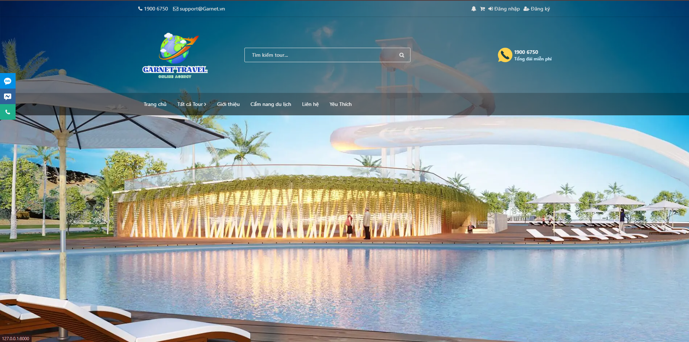

# Booking Garnet Travel

Garnet Travel là một ứng dụng web được phát triển bằng Laravel, hỗ trợ người dùng đặt tour du lịch trực tuyến, quản lý thông tin khách hàng, tour, và các giao dịch một cách dễ dàng và tiện lợi.

## 🎯 Tính năng chính

- Quản lý danh sách tour du lịch (CRUD).
- Đặt tour trực tuyến cho khách hàng.
- Quản lý thông tin khách hàng và giao dịch.
- Tìm kiếm và lọc tour theo địa điểm, ngày khởi hành, giá, v.v.
- Gửi email xác nhận khi đặt tour thành công.

## 🚀 Công nghệ sử dụng

- **Backend**: Laravel 10.x
- **Frontend**: Blade Template + HTML/CSS/JS 
- **Cơ sở dữ liệu**: MySQL
- **Server**: Laragon (hoặc môi trường PHP tương tự)
- **Khác**: Composer, NPM, Mailtrap (hoặc SMTP)

## 📦 Cài đặt

1. **Clone dự án từ repository**:
   ```bash
   git clone <repository_url>
   cd booking-garnet-travel
2. **Cài đặt các dependency**:
   ```bash
    composer install
    npm install
    npm run dev
3. **Tạo file .env và cấu hình**:
   ```bash
   cp .env.example .en
4. **Tạo database và migrate**:
    ```bash
   php artisan migrate --seed
5. **Tạo khóa ứng dụng**:
    ```bash
    php artisan key:generate
6. **Khởi động server**:
    ```bash
    php artisan serve
7. **Mail hàng chờ**:
    ```bash
    php artisan queue:work
8. **Truy cập ứng dụng tại**:
    [http://localhost:8000](http://localhost:8000)

## 🛠️ Lệnh Artisan hữu ích

- Tạo dữ liệu mẫu:
  ```bash
  php artisan db:seed
  ```
- Xóa và làm mới database:
  ```bash
  php artisan migrate:fresh --seed
  ```
- Kiểm tra route:
  ```bash
  php artisan route:list
  ```

## 📂 Cấu trúc thư mục chính

- **app/**: Chứa logic của ứng dụng.
- **resources/views/**: Giao diện frontend với Blade Template.
- **routes/web.php**: Định tuyến cho ứng dụng.
- **database/**: Migration và dữ liệu mẫu.

## 📋 Ghi chú phát triển

1. **Yêu cầu hệ thống**:
   - PHP >= 8.1
   - Composer >= 2.5
   - Node.js >= 18.x
   - MySQL >= 8.x

2. **Mailtrap**:
   - Sử dụng Mailtrap hoặc SMTP khác để cấu hình gửi email xác nhận.

3. **Môi trường phát triển**:
   - Khuyến nghị sử dụng Laragon hoặc Docker để tối ưu hóa quá trình phát triển.


## 📧 Liên hệ

- **Email**: support@garnettravel.com
- **Website**: [Garnet Travel](https://garnettravel.com)

---